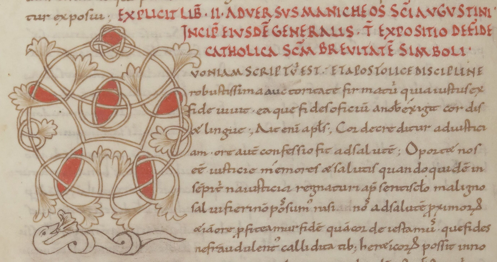
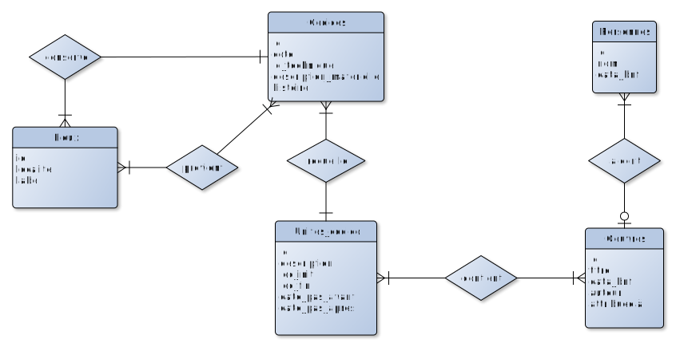

La librairie de Moissac
===



*La librairie de Moissac* est une application Python-Flask qui permet la consultation et l'enrichissement d'une base de données des manuscrits attestés dans la *librairie* (c'est-à-dire la bibliothèque) de l'abbaye Saint-Pierre de Moissac tout au long du Moyen Âge. 

# Présentation générale
## L'histoire
Puissante abbaye bénédictine fondée au VIIe siècle, l'abbaye de Moissac devint au XIe siècle un centre de production de manuscrits très actif ainsi que le donataire de nombreux autres *codices*, provenant en particulier de l'abbaye de Cluny. Ses livres firent la délectation des collectionneurs à partir du XVIe siècle, tout particulièrement de Jean-Baptiste Colbert. Versée dans les collections de la Bibliothèque du Roi en 1732, la collection Colbert conduisit *in fine* de nombreux manuscrits faits ou possédés par l'abbaye de Moissac au sein des collections de la Bibliothèque nationale de France.

## Les sources des données
Cette application propose les notices d'une petite partie de ces *codices*. Pour chacun d'entre-eux, nous avons récolté les informations ayant trait à leur histoire et à leur contenu dans deux sources :
- Les notices de ces *codices* publiées sur les sites des institutions qui les conservent, en particulier le site de la Bibliothèque nationale de France [Archives et manuscrits](https://archivesetmanuscrits.bnf.fr) ;
- Le catalogue établi par Jean Dufour pour sa thèse d'École des chartes en 1963 :
    - La position de cette thèse est accessible sur le site [Thenc@ : Thèses ENC accessibles en ligne](https://bibnum.chartes.psl.eu/s/thenca/item/56764#?c=&m=&s=&cv=&xywh=-2%2C-1%2C4%2C1) ;
    - L'ouvrage a été remanié et publié par la suite : *La bibliothèque et le scriptorium de Moissac*, Genève, Droz, 1972.

# Installation
Téléchargez l'archive zip de l'application, disponible sur cette page via le bouton **Code**, puis dézippez-la dans le dossier de votre choix.

## Sous Windows
L'installation de Python 3 est nécessaire pour utiliser cette application. Nous recommandons la distribution [Anaconda](https://www.anaconda.com/products/individual).

Une fois la distribution Anaconda installée :
- Lancez depuis le menu Démarrer l'**Anaconda Powershell Prompt** ;
- Déplacez-vous dans le dossier de l'application dézippée ;
- Créez un environnement virtuel à l'aide de la commande :
    ```shell
    $ python3 -m venv env
    ```
- Activez cet environnement virtuel à l'aide de la commande (opération à **réitérer** à chaque lancement de l'application) :
    ```shell
    $ source env/bin/activate
    ```
- Installer les modules requis grâce à la commande :
    ```shell
    $ pip install -r requirements.txt
    ```
- Lancez l'application grâce à la commande :
    ```shell
    python3 run.py
    ```
- Vous devriez pouvoir ouvrir l'application dans un navigateur web grâce à [ce lien](http://127.0.0.1:5000/).

## Sous Linux (Ubuntu/Debian)
- Pour installer Python 3, ouvrez un terminal et saisissez la commande :
    ```shell
    $ sudo apt-get install python3 libfreetype6-dev python3-pip python3-virtualenv
    ```
- Déplacez-vous dans le dossier de l'application dézippé.
- Créez un environnement virtuel à l'aide de la commande :
    ```shell
    $ python3 -m venv env
    ```
- Activez cet environnement virtuel à l'aide de la commande (opération à **réitérer** à chaque lancement de l'application) :
    ```shell
    $ source env/bin/activate
    ```
- Installer les modules requis grâce à la commande :
    ```shell
    $ pip install -r requirements.txt
    ```
- Lancez l'application grâce à la commande :
    ```shell
    python3 run.py
    ```
- Vous devriez pouvoir ouvrir l'application dans un navigateur web grâce à [ce lien](http://127.0.0.1:5000/).

# Sélection des données et choix de modélisation
Tout en récoltant les descriptions à caractère historique et matériel proposées par les notices du site [Archives et manuscrits](https://archivesetmanuscrits.bnf.fr) ainsi que certaines informations à caractère paléographique (plutôt issues de l'ouvrage de J. Dufour), nous avons modélisé dans notre base de données les informations suivantes :
- La plus grande attention a été accordée aux **oeuvres** contenues dans les *codices* avec leur **auteur** ;
- Nous avons également modélisé l'**origine** de ces *codices*, c'est-à-dire le lieu (ou les lieux hypothétiques) où ils ont été fabriqués (qui n'est pas toujours Moissac) ;
- Ainsi que les lieux de **provenance** de ces manuscrits, c'est-à-dire les lieux autres que Moissac (dénominateur commun de notre collection) où ils ont été conservés au Moyen Âge ou à l'époque moderne (notamment les collections comme celle de Colbert).

## Modèle conceptuel


## Les unités codicologiques
Nous avons opté pour un modèle conceptuel qui distingue les *codices* des **unités codicologiques** qui les composent. La plupart des *codices* sont d'un seul tenant : ils ne contiennent donc qu'une seule unité codicologique. Mais d'autres sont de nature composite, en particulier **Paris, BnF, Latin 2077**. Les oeuvres contenues ont donc été associées à chacune de ces unités plutôt qu'au *codex* en général, et ce afin d'en respecter la chronologie propre.

# Fonctionnalités
## Index
Deux index analytiques sont proposés à la consultation :
- Les auteurs ;
- Les oeuvres.

## Recherche
L'application propose deux modalités de recherche dans la base de données : simple et avancée.

### Recherche simple
La recherche simple est inclusive par défaut et ne retourne que des *codices* : elle retourne par conséquent tous les *codices* pertinents par rapport à chacun des mots-clés de la saisie. L'opérateur "ET" peut être saisi avec les mots-clés, ce qui rend la recherche exclusive : elle ne renvoie dès lors que les *codices* pertinents par rapport à tous les mots-clés saisis.

Afin de bénéficier des multiples formes de titres d'oeuvre et de noms d'auteurs décrits sur [data.bnf.fr](https://data.bnf.fr/), cette recherche croise les identifiants ark d'auteurs et d'oeuvres contenus dans la base de données de l'application avec les ark répondant aux mêmes mots-clés interrogés sur data.bnf.fr. Il est donc possible de trouver les *codices* associés à l'auteur "Augustin (saint, 354-430)" en employant les mots-clés "augustinus hipponensis" par exemple. Il en va de même pour les titres d'oeuvres.

### Recherche avancée
De même que la recherche simple, toutes les formes de noms d'auteurs ou de titres d'oeuvres existant sur data.bnf.fr sont moissonnés par la recherche avancée et croisés avec les données de la base locale.

La recherche avancée est à la fois exclusive et inclusive : 
- Elle ne renvoie que les *codices* pertinents par rapport à tous les mots-clés saisis ;
- Elle renvoie les oeuvres répondant à tous les mots-clés saisis dans le champ "oeuvre" (indépendamment des mots-clés saisis dans le champ "auteur") ;
- Elle renvoie les auteurs répondant à tous les mots-clés saisis dans le champ "auteur" (indépendamment des mots-clés saisis dans le champ "oeuvre") ;

Enfin, l'opérateur "OU" peut être saisi dans les champs "oeuvre" et "auteur", ce qui rend la recherche inclusive pour ces types de données respectifs.

Prenons pour exemple une recherche portant sur les mots-clés suivants :
- Auteur : "Augustin OU Grégoire"
- Oeuvre : "corpore"

Elle retournera :
- En auteurs : saint Augustin et Grégoire le Grand ;
- En oeuvres : *De corpore et sanguine Domini*, Paschase Radbert (saint) ;
- En codex : Paris, BNF, Latin 2077, car il contient à la fois des oeuvres d'Augustin, d'autres de Grégoire, et le *De corpore et sanguine Domini*, Paschase Radbert.

Une recherche portant sur les mots-clés suivants :
- Auteur : "Augustin Grégoire"
- Oeuvre : "corpore"

retournera :
- En auteurs : rien, car aucun auteur ne contient Augustin et Grégoire dans son nom ;
- En oeuvres : *De corpore et sanguine Domini*, Paschase Radbert (saint) ;
- En codex : Paris, BNF, Latin 2077 et Leiden, Universiteitsbibliotheek, BPL 1822 car ils contiennent tous les deux le *De corpore et sanguine Domini* de Paschase Radbert.

Une recherche portant sur les mots-clés suivants :
- Auteur : "Augustin OU Grégoire"
- Oeuvre : "Apologeticum"

retournera :
- En auteurs : saint Augustin et Grégoire le Grand ;
- En oeuvres : *Apologeticum*, Tertullien.
- En codex : aucun, car aucun *codex* ne contient à la fois des oeuvres d'Augustin, d'autres de Grégoire et l'*Apologeticum* de Tertullien.

Enfin, une recherche portant sur le seul mot-clé suivant :
- Auteur : "saint"

retournera une longue liste d'auteurs, mais aucun *codex*, car aucun *codex* ne réunit des oeuvres de chacun des auteurs de la liste retournée.

## Création de contenus
Dans la mesure où les objets principaux de la base de données sont les *codices*, il n'est pas possible de créer une oeuvre indépendamment de son contenant. La création d'une oeuvre est strictement conditionnée à son rattachement à une unité codicologique déterminée dans un *codex* déterminé : elle ne peut se faire que par le formulaire de mise à jour d'un codex, au niveau d'une unité codicologique particulière.

Pour les oeuvres qui ne sont pas anonymes, elles ne peuvent être créées qu'une fois leur auteur créé.

Cette démarche a été développée de manière contraignante : seuls les auteurs et les oeuvres présents sur le site data.bnf.fr peuvent être sélectionnés. Leur récupération est opérée au moyen de requêtes sparql adressées au sparql *endpoint* de [data.bnf.fr](https://data.bnf.fr/sparql/). Il s'agit de contraindre l'utilisateur à privilégier des données liées (*linked data*) avant de lui donner la possibilité (non encore développée dans l'application), de créer des contenus *ad hoc*.

Ce privilège accordé aux données liées apporte de l'eau au moulin des fonctionnalités de recherche de l'application, exposées ci-dessus (réservoirs de formes alternatives pour les noms et titres).

# Développements possibles
## Création et mise à jour
En l'état de l'application, plusieurs fonctionnalités ne sont pas offertes à l'utilisateur et constitueraient des développements jugés prioritaires :
- Créer de nouvelles unités codicologiques ;
- Créer des auteurs ou des oeuvres absents de Data-BNF ;
- Filtrer les recherches par date ;
- Ajouter des liens de type **attribution** entre une oeuvre et une personne.

## Modélisation des données
La structuration actuelle des *codices* en unités codicologiques ne permet pas d'associer deux parties d'un codex, séparées l'une de l'autre et pourtant conçues dans le même temps. Le problème se pose avec le codex 6 : Paris, BnF, Latin 1656A. Il comporte deux additions, au début et à la fin de l'ouvrage, qui devraient former une seule "unité codicologique" (ou addition significative) dont la localisation dans le codex serait discontinue. C'est un cas rare.

L'entité **Personnes** a été envisagée non seulement pour recevoir les auteurs des entités de type **Oeuvres** mais aussi pour les possesseurs des manuscrits. Cette relation n'a pas été implémentée dans l'application pour le moment.

# Contenu de la base de données et particularités de modélisation
## Exhaustivité des données
La description du contenu textuel des *codices* est exhaustive pour les *codices* portant les identifiants de 1 à 5 ; elle est en revanche partielle pour le codex 6.

## Source des descriptions
Les descriptions textuelles (matérialité, histoire) sont issues des notices de la BNF telles que publiées sur le site Archives et manuscrits.

Les citations issues de l'ouvrage de J. Dufour sont accompagnées de la mention **(JD, BSM)**.

Concernant l'**origine** des *codices* et la **datation** des unités codicologiques, les informations fournies par J. Dufour ont été privilégiées.

Les informations relatives au manuscrit London, Harley 3078 ont été traduites par nos soins à partir de celles présentées sur la notice institutionnelle (accessible [ici](https://www.bl.uk/catalogues/illuminatedmanuscripts/record.asp?MSID=4097&CollID=8&NStart=3078)).

## Définition des entités et des attributs de la base de données
- **Unités codicologiques** :
    - `descript` : cet attribut est dévolu à une description facultative de l'unité codicologique ; deux cas de figure se présentent : 
        - Si le codex ne comprend qu'une seule unité codicologique, on ne renseignera que d'éventuelles considérations paléographiques (apparaîtra sous le titre "Paléographie" dans le *frontend* de la notice) ;
        - Si le codex comprend plusieurs unités codicologiques, aux considérations paléographiques on pourra adjoindre une description matérielle de l'unité codicologique (elle apparaîtra alors comme paragraphe d'introduction à la liste des oeuvres de l'unité codicologique).
- **Oeuvres** :
    - `attr` : cet attribut, qui renseigne l'identifiant d'un auteur, signifie qu'il peut s'agir d'une attribution apocryphe ou bien d'une hypothèse analytique.

- **Provenances** : 
    cette table de relation dotée d'attributs complémentaires rassemble les informations relatives à la fois à l'origine (booléen) et aux provenances des manuscrits. Ces relations prennent pour cible des entités de la classe Codices et non des entités de type unités codicologiques.
    - `cas_particulier` : cet attribut permet, en tant que clé étrangère, de relier éventuellement un enregistrement à une UC particulière.